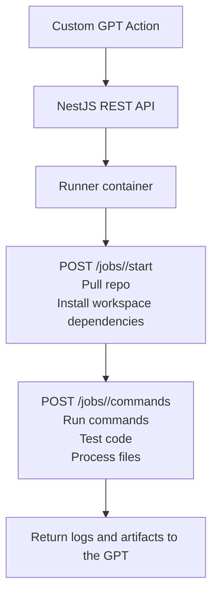

<p align="center">
  
</p>

<p align="center"><strong>GPT Runner</strong></p>

<p align="center">
  
  
  
  
  
  
</p>

This project is a Custom GPT-powered code experimentation sandbox

## Production Startup

### 1. Install dependencies

```bash
npm ci
```

### 2. Configure environment variables

Copy `.env.example` to `.env` and set at least:

- `ACTION_API_KEY`
- `PUBLIC_ARTIFACT_SECRET`
- `MONGO_URI`
- `MONGO_DB`
- `MONGO_LOGS_COLLECTION`
- `HOST`
- `PORT`
- `PUBLIC_BASE_URL`

Example:

```bash
cp .env.example .env
```

### 3. Start MongoDB

```bash
docker compose up -d mongo
```

### 4. Build the API

```bash
npm run build
```

### 5. Start the API

```bash
npm start
```

The API listens on `127.0.0.1:8000` by default. Override that with `HOST` and `PORT` in `.env`.
Set `PUBLIC_BASE_URL` to the externally reachable API origin used in generated job and artifact download URLs.

Swagger UI is available at `http://127.0.0.1:8000/docs`.

Each job create request must include a `docker_image_name` field; the API stores that value on the job record and uses it when the job starts.

Use `POST /jobs/<jobId>/start` to pull the job repository and bootstrap workspace dependencies. Use `POST /jobs/<jobId>/commands` to run the actual job commands inside that prepared workspace.

## Test Setup

Seed the available docker image catalog used by tests and local fixtures:

```bash
npm run seed:available-images
```

This inserts the `runner/Dockerfile.spritefusion` entry with the goal `remove pixel art mixels from ai and scale that image`.

Running `npm run test` also seeds the available docker image catalog before the test suite starts.

Job files and artifacts are stored under the repo-local `./storage/<jobId>/...` directory relative to the process working directory.
Artifact download URLs are returned from authenticated `GET /jobs/<jobId>/artifacts`. The returned artifact download URLs are public signed URLs that require a valid `signature` query parameter generated with `PUBLIC_ARTIFACT_SECRET`.

# FLOWCHART


