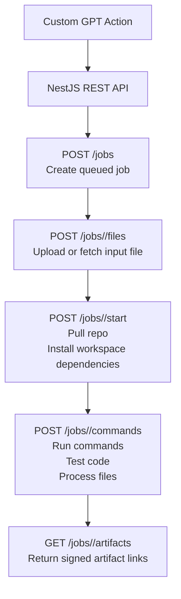

<p align="center">
  
</p>

<p align="center"><strong>GPT Runner</strong></p>

<p align="center">
  
  
  
  
  
  
</p>

This project is a Custom GPT-powered code experimentation sandbox.

## Overview

GPT Runner exposes a NestJS API for creating jobs, preparing a disposable workspace, running commands, and collecting artifacts.

Swagger UI is served at `http://127.0.0.1:1234/docs` by default, and the generated OpenAPI document is available at `/openapi.json`.

## Production Startup

### 1. Install dependencies

```bash
npm ci
```

### 2. Configure environment variables

Copy `.env.example` to `.env` and set at least:

- `ACTION_API_KEY`
- `PUBLIC_ARTIFACT_SECRET`
- `MONGO_URI`
- `MONGO_DB`
- `MONGO_LOGS_COLLECTION`
- `HOST`
- `PORT`
- `PUBLIC_BASE_URL`

```bash
cp .env.example .env
```

`PUBLIC_BASE_URL` should point to the externally reachable API origin used in job and artifact URLs. If it is not set, the API falls back to the incoming request origin when building links.

### 3. Start MongoDB

```bash
docker compose up -d mongo
```

### 4. Build the API

```bash
npm run build
```

### 5. Start the API

```bash
npm start
```

## 6. Build supported images

Build every image helper under `images/`:

```bash
npm run build:images
```

The API listens on `127.0.0.1:1234` by default. Override that with `HOST` and `PORT`.

## Job Flow

1. `POST /jobs` creates a queued job. The request must include `goal` and `docker_image_name`.
2. `POST /jobs/:jobId/files` uploads the input file or downloads a referenced file into `/workspace/input.png`.
3. `POST /jobs/:jobId/start` clones the repository, checks out the requested branch when provided, and installs workspace dependencies.
4. `POST /jobs/:jobId/commands` runs commands inside the prepared workspace.
5. `GET /jobs/:jobId/artifacts` lists generated artifacts and returns public signed download URLs.
6. `GET /jobs/:jobId/artifact` serves a single artifact when the `signature` query parameter matches `PUBLIC_ARTIFACT_SECRET`.

Useful supporting routes:

- `GET /jobs`
- `GET /jobs/queued`
- `GET /jobs/:jobId`
- `DELETE /jobs/:jobId`

## Storage

Job files and artifacts are stored under the repo-local `./storage/<jobId>/...` directory relative to the process working directory.

Artifact download URLs are signed and public. Each artifact URL includes a `signature` query parameter generated with `PUBLIC_ARTIFACT_SECRET`.

The SpriteFusion image build helper lives at `images/build-spritefusion.sh`.

`npm run test` runs the unit test suite.

`npm run test:integration` seeds the available Docker image catalog, builds the Docker images, and then runs the integration test suite.

`npm run ci` runs lint/typecheck, unit tests, and integration tests in that order.

## API Notes

The job create request stores `docker_image_name` on the job record and reuses it when the job starts.

`POST /jobs/:jobId/start` is the bootstrap step for pulling the repo and installing dependencies.

`POST /jobs/:jobId/commands` is the execution step for running the actual job commands inside the prepared workspace.

`POST /jobs/:jobId/files` accepts either an uploaded file or an OpenAI file reference and normalizes it to `/workspace/input.png`.

The upload endpoint accepts one input file at a time and rejects payloads larger than 50 MB.

# FLOWCHART


