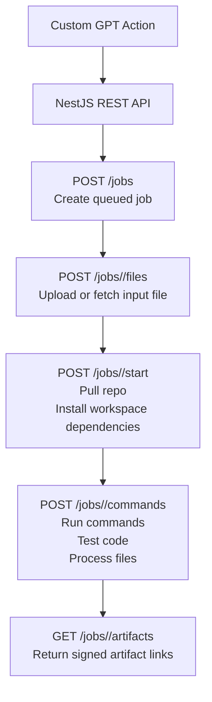

# Technical Reference

## Job Flow

1. `POST /jobs` creates a queued job. The request must include `goal` and `available_job_id`.
2. `POST /jobs/:jobId/files` uploads the input file or downloads a referenced file into `/workspace/input.png`.
3. `POST /jobs/:jobId/start` clones the repository, checks out the requested branch when provided, and installs workspace dependencies.
4. `POST /jobs/:jobId/commands` runs commands inside the prepared workspace.
5. `GET /jobs/:jobId/artifacts` lists generated artifacts and returns public signed download URLs.
6. `GET /jobs/:jobId/artifact` serves a single artifact when the `signature` query parameter matches `PUBLIC_ARTIFACT_SECRET`.

Useful supporting routes:

- `GET /available-jobs`
- `GET /available-jobs/:id`
- `GET /jobs`
- `GET /jobs/queued`
- `GET /jobs/:jobId`
- `DELETE /jobs/:jobId`

## Storage

Job files and artifacts are stored under the repo-local `./storage/<jobId>/...` directory relative to the process working directory.

Artifact download URLs are signed and public. Each artifact URL includes a `signature` query parameter generated with `PUBLIC_ARTIFACT_SECRET`.

The SpriteFusion image build helper lives at `images/build-spritefusion.sh`.

## API Notes

The job create request stores `available_job_id` on the job record and the runner resolves the docker image name from the available jobs catalog when the job starts.

`POST /jobs/:jobId/start` is the bootstrap step for pulling the repo and installing dependencies.

`POST /jobs/:jobId/commands` is the execution step for running the actual job commands inside the prepared workspace.

`POST /jobs/:jobId/files` accepts either an uploaded file or an OpenAI file reference and normalizes it to `/workspace/input.png`.

The upload endpoint accepts one input file at a time and rejects payloads larger than 50 MB.
